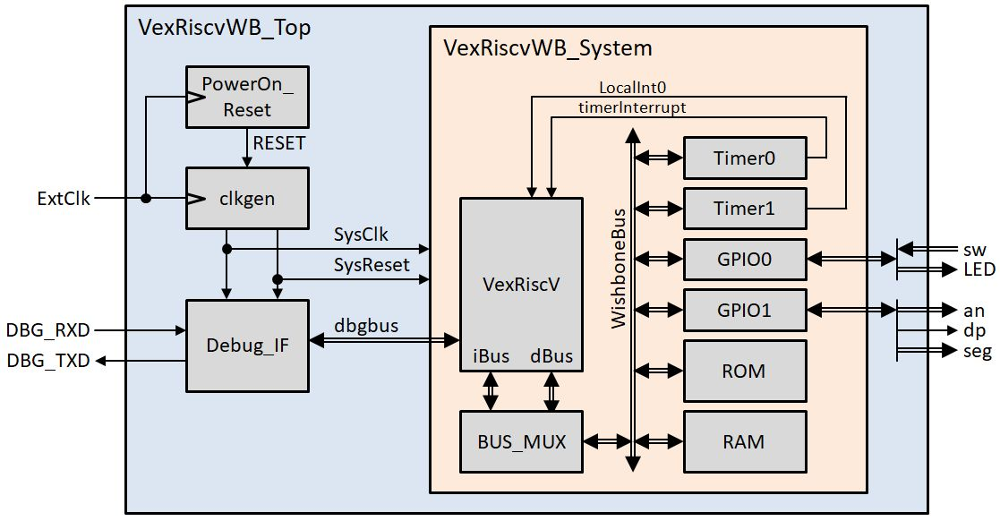
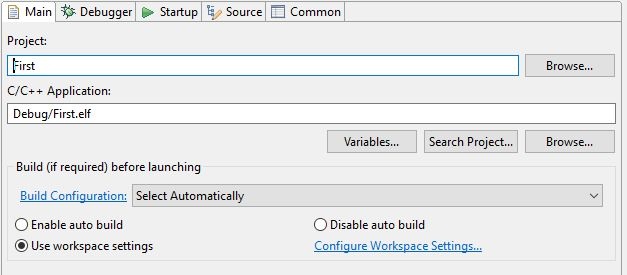
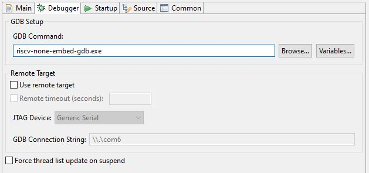
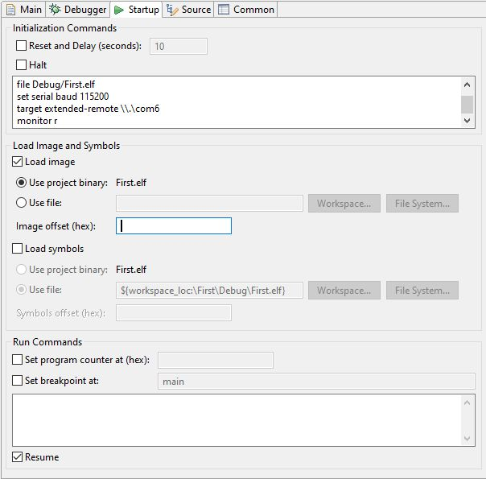

## VexRiscv System with Hardware GDB-Server for Basys3
This project contains an example system with VexRiscv and a GDB-Server in hardware. It can directly connected with `gdb` via serial port without any Software-GDB-Server.
The project can be simulated and synthesized.

The system runs on [Basys3 from Digilent](https://digilent.com/reference/programmable-logic/basys-3/start). The VexRiscv is configured with Wishbone bus, jump table and external interrupts. See `VexRiscvWB_small.scala` for details.
The system contains:

 - RAM memory of size 16k at address `0x00000000`
 - simulated ROM of size 16k at address `0x00010000`
 - GPIO 0 at address `0x00008000` connected to the Basys2 LEDs (Bits 15..0) and switches (Bits 31..16)
 - GPIO 1 at address `0x00008100` connected to the Basys2 7-Seg Display: Segment (Bits 6..0), DP (Bit 7), and anodes (Bits 11..8)
 - Timer 0 at address `0x00008200` connected to VexRiscv Timer Interrupt
 - Timer 1 at address `0x00008300`connected to VexRiscv Loacal Interrupt 0
 
All these values can be changed, see `VexRiscvWB_System.vhd`. 

The system can be simulated with the testbench `VexRiscvWB_TOP_TB.vhd`. During simulation the system executes a program that can be found in directory `Test_Program`. The program is loaded by the testbench into the system via RSP-commands and then executed. 
For simulation with ModelSim the script file `VexRiscvWB_TOP_TB.do` is supplied. The simulation requires the `unisim`-library from Xilinx. 
Simulation with Vivado is also possible.

In directory `Synth_Basys3` a Xilinx project file for Vivado 2020.1 is given which allows to synthesize the system. 
Further an already generated bitfile `VexRiscvWB_TOP.bit` is supplied that can directly be loaded into `Basys3` without synthesizing.

Directory `Test_WS` contains an Eclipse-project `First`. It demonstrates how to use the GPIO and how to handle the timer interrupts. It connects the 16 switches to the 16 LEDs. Further it controls the 7Sement display and shows a hexadecimal counter value that increments each second. 
Setup your Eclipse workspace with the Risc-V toolchain and import the project `First` into your workspace. 

To connect GDB via the correct serial port of the `Basys3`-Board to the Hardware-GDB_Server (named `Debug_IF` in the above image) check the windows device manager. In the current settings COM6 is used. Adapt your debug configuration to the choosen serial port number of your computer. 
Below the settings for the debug configuration is shown. Consider that the remote connection is not setup in the Debugger Tab but in the Startup Tab.

If you want to use the hardware breakpoints of the VexRiscV you should use the following Commands in the Eclipse Startup Tab:
<pre><code>  file Debug/First.elf
  set serial baud 115200
  target extended-remote \\\\.\\com6
  monitor r
  load Debug/First.elf
  mem 0x10000 0x1ffff ro
  mem 0x0000 0xffff rw
</code></pre>
 

**Have fun**
